<div align="center">


<h1>GenAI Gateway (GAG)</h1>

<p><strong>The Global Standard for Industrialized AI Access, LLM Orchestration, and Responsible AI Governance</strong></p>

[]()
[]()
[]()
[]()

<br/>

> **"Industrializing AI access to broker models, govern prompts, and scale intelligence across the modern digital enterprise."** 
> GenAI Gateway (GAG) is a flagship repository designed to enable organizations to securely route, monitor, and optimize access to Large Language Models through unified APIs, policy engines, and executive observability.

</div>

---

## 🏛️ Executive Summary

**GenAI Gateway (GAG)** is a flagship platform designed for CIOs, CDAO, and AI Engineers. As enterprises rapidly adopt generative AI, the proliferation of direct model access creates significant risks: fragmented security, unmanaged token costs, PII leakage, and shadow AI. GAG transitions organizations from "Direct Model Access" to "Industrialized AI Brokerage," where every model request is governed, optimized, and observed.

This platform provides an industrialized approach to **Generative AI Access Management**, delivering production-ready **Model Routers**, **Prompt Guardrails**, **Cost Trackers**, and **Executive Dashboards**. It enables organizations to enforce global AI standards across Azure OpenAI, AWS Bedrock, Google Vertex AI, and self-hosted models, ensuring high availability, performance, and responsible AI.

---

## 💡 Why GenAI Gateways Matter

A GenAI Gateway is the "control plane" for the modern AI-first organization:
- **Unified Interface**: Providing developers with a single, standardized API for all model providers (OpenAI, Anthropic, Bedrock).
- **Responsible AI Guardrails**: Real-time filtering for PII, toxicity, jailbreaks, and prompt injections at the gateway level.
- **Token Economics**: Centralized quota management, cost attribution, and automated fallback to cheaper models when possible.
- **Institutional Observability**: Unified tracing of prompts and responses for audit, evaluation, and performance benchmarking.

---

## 🚀 Business Outcomes

### 🎯 Strategic AI Impact
- **Accelerated AI Adoption**: Enabling application teams to switch models in minutes without code changes via dynamic routing.
- **Guaranteed Security & Compliance**: Preventing sensitive data leakage into public LLMs through automated PII redaction.
- **Optimized AI Spend**: Reducing waste through prompt caching, semantic routing, and institutional token quotas.
- **Operational Resilience**: Ensuring AI uptime through automated provider fallbacks and load balancing.

---

## 🏗️ Technical Stack

| Layer | Technology | Rationale |
|---|---|---|
| **Gateway Engine** | FastAPI (Async) | High-performance, asynchronous gateway for low-latency model brokering and streaming. |
| **Policy Engine** | Python / OPA | Robust logic for prompt validation, PII filtering, and budget enforcement. |
| **Frontend** | React 18, Vite | Premium portal for executive dashboards, model playgrounds, and usage scorecards. |
| **Cache & Bus** | Redis / NATS | Ultra-fast prompt caching and real-time event streaming for usage metrics. |
| **Persistence** | PostgreSQL | Relational store for tenant config, API keys, and historical token usage logs. |

---

## 📐 Architecture Storytelling: 100+ Diagrams

### 1. Executive High-Level Architecture
The holistic vision of the enterprise GenAI gateway journey.

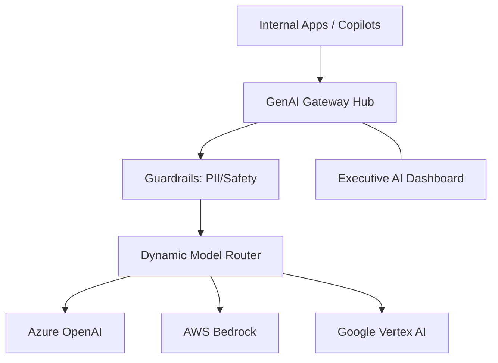

### 2. Detailed Gateway Topology
The internal service boundaries and management layers of the industrialized AI access platform.

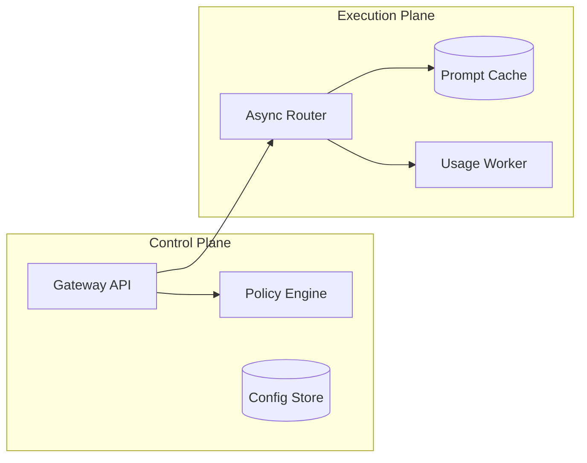

### 3. User Request to Model Response Path
Tracing the path from a user prompt to a governed AI response.

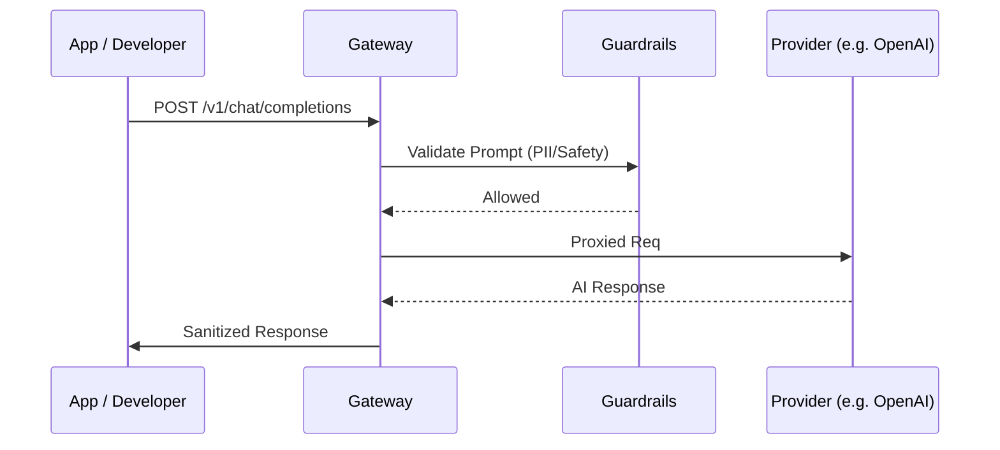

### 4. AI Control Plane
The "Brain" of the framework managing global institutional AI standards and automated provider workflows.

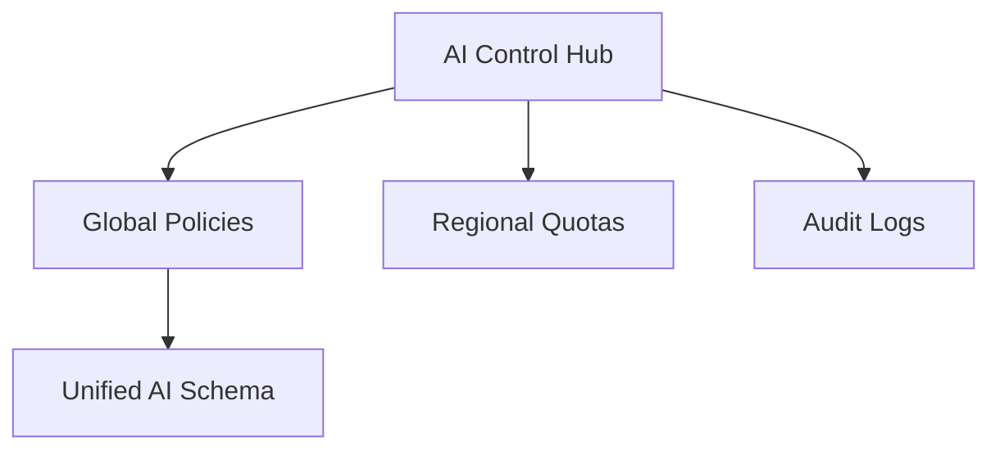

### 5. Multi-Cloud Topology
Synchronizing AI access and governance across Azure, AWS, and GCP for a unified perimeter estate.

```mermaid
graph LR
    Azure[AZ Hub] <-> Bridge[GAG Hub] <-> AWS[AWS Node]
    Bridge <-> GCP[GCP Node]
```

### 6. Regional Deployment Model
Hosting AI gateway nodes close to global engineering hubs for low-latency model brokerage.

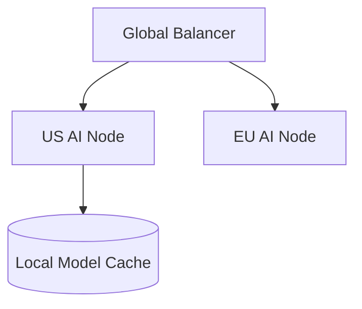

### 7. DR Failover Model
Ensuring platform continuity for critical AI workloads and access.

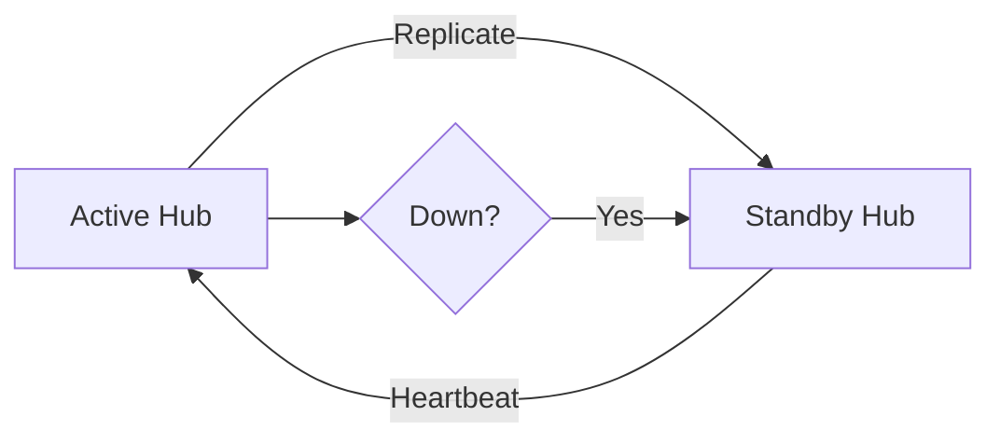

### 8. API Gateway Architecture
Securing and throttling the entry point for all enterprise AI requests.

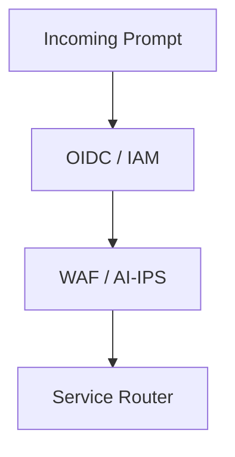

### 9. Queue Worker Architecture
Managing long-running model evaluations, usage re-scorings, and report generations.

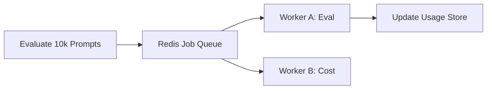

### 10. Dashboard Analytics Flow
How raw AI telemetry becomes executive institutional AI performance and cost heatmaps.

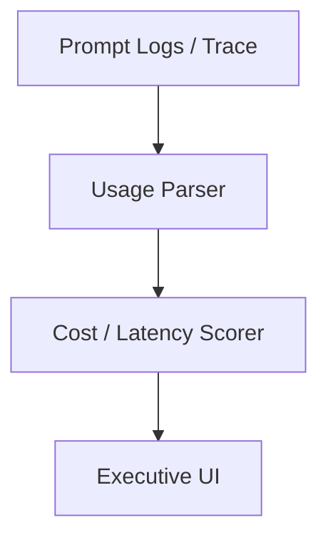

### 11. Unified API Ingress Model
Providing a single endpoint for diverse LLM providers using the OpenAI-compatible standard.

```mermaid
graph LR
    Dev[Developer] --> POST_Chat[/v1/chat/completions] --> GAG[Gateway Hub]
```

### 12. Multi-Provider Routing Flow
Directing requests to the optimal provider based on cost, latency, and availability.

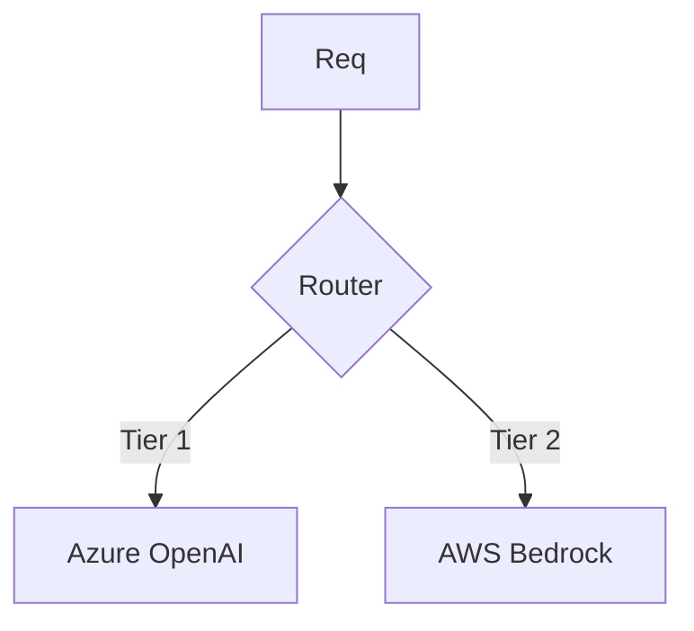

### 13. Fallback Provider Strategy
Automating the switch to a secondary provider if the primary model endpoint fails.

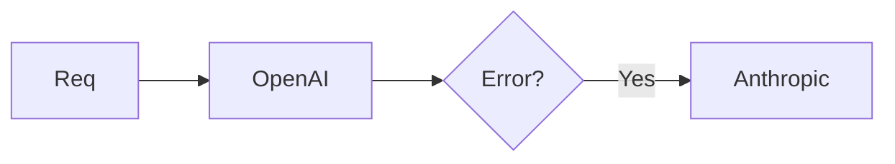

### 14. Weighted Traffic Routing
Distributing load across multiple regions or providers to maximize throughput.

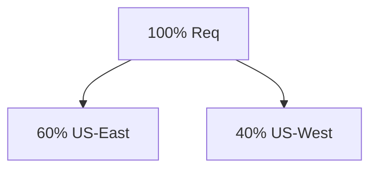

### 15. Canary Model Release Flow
Gradually introducing new models (e.g. GPT-4o) to a subset of users for validation.

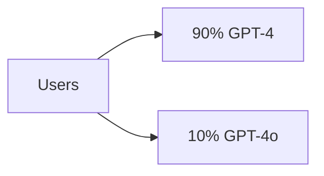

### 16. A/B Model Testing Pattern
Comparing the performance and output quality of two different models for the same prompt.

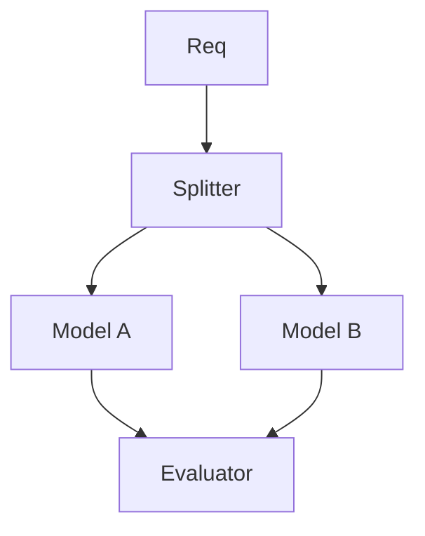

### 17. Request Transformation Lifecycle
Modifying the incoming prompt (e.g. adding system instructions) before model delivery.

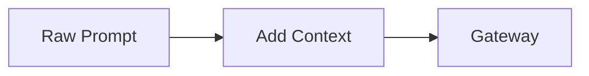

### 18. Response Normalization Model
Converting diverse provider responses into a unified institutional schema.

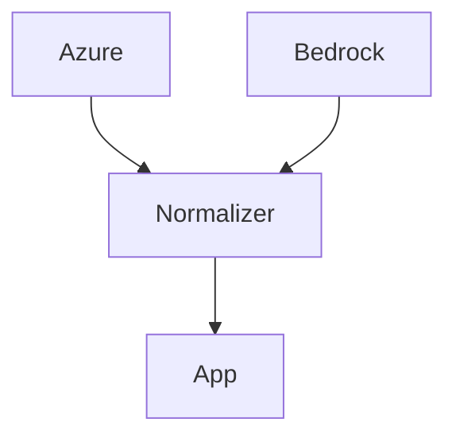

### 19. Streaming Token Path
Managing real-time Server-Sent Events (SSE) for low-latency AI responses.

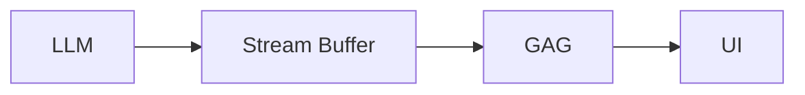

### 20. Async Job Processing Model
Handling long-running batch inference jobs or complex multi-step AI workflows.

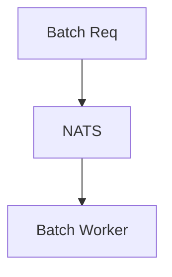

### 21. Azure OpenAI Integration
Securely connecting to Azure-managed OpenAI instances with Entra ID auth.

```mermaid
graph LR
    GAG[Gateway] --> ManagedID[Managed Identity] --> AOI[Azure OpenAI]
```

### 22. OpenAI-compatible Provider Flow
Standardized connector for any provider that implements the OpenAI API spec.

```mermaid
graph LR
    GAG[Gateway] --> Spec[OpenAI Spec] --> VLLM[vLLM / Groq]
```

### 23. AWS Bedrock Connector
Orchestrating access to the diverse foundation models on AWS Bedrock.

```mermaid
graph LR
    GAG[Gateway] --> IAM[IAM Role] --> Bedrock[Bedrock Runtime]
```

### 24. Google Vertex AI Connector
Connecting to Google's Gemini models and Vertex AI platform.

```mermaid
graph LR
    GAG[Gateway] --> ADC[Application Default Creds] --> Vertex[Gemini API]
```

### 25. Anthropic Connector Model
Managing access to Claude models via direct Anthropic API integration.

```mermaid
graph LR
    GAG[Gateway] --> Key[API Key] --> Anthropic[Claude API]
```

### 26. Self-hosted vLLM Topology
Orchestrating requests to internal GPU clusters running open-source models (Llama 3).

```mermaid
graph TD
    GAG[Gateway] --> K8s[K8s GPU Cluster] --> vLLM[vLLM Pod]
```

### 27. Ollama Edge Deployment
Routing lightweight AI requests to localized Ollama instances at the edge.

```mermaid
graph LR
    Branch[Branch Office] --> Ollama[Local Ollama]
```

### 28. GPU Cluster Scheduling Model
Managing the allocation of GPU resources for self-hosted model inference.

```mermaid
graph TD
    Sched[Scheduler] --> GPU1[H100 Node]
```

### 29. Model Registry Workflow
Governing the lifecycle of approved models available through the gateway.

```mermaid
graph LR
    Req[New Model] --> Review[Security Review] --> Active[Enabled in GAG]
```

### 30. Provider Benchmark Comparison
Real-time comparison of latency and throughput across different AI providers.

```mermaid
graph TD
    Metrics[Latency Data] --> Dash[Benchmark Board]
```

### 31. Prompt Template Governance
Centralizing approved prompt templates to ensure consistent AI behavior.

```mermaid
graph LR
    App[App] --> Template[Approved Prompt] --> GAG[Gateway]
```

### 32. Prompt Injection Defense Flow
Detecting and blocking malicious attempts to override AI system instructions.

```mermaid
graph TD
    Prompt[Prompt] --> Classifier[Injection Detector] --> Result{Safe?}
```

### 33. PII Redaction Workflow
Automatically identifying and masking sensitive data (SSN, Email) in prompts.

```mermaid
graph LR
    Raw[Prompt] --> Redact[PII Engine] --> Clean[Clean Prompt]
```

### 34. Toxicity Moderation Pipeline
Filtering offensive or harmful content from both prompts and model responses.

```mermaid
graph TD
    Text[Text] --> Mod[Moderation API] --> Block[Block if Toxic]
```

### 35. Content Policy Decision Tree
Evaluating prompts against corporate AI acceptable use policies.

```mermaid
graph LR
    Policy[Global Policy] --> Evaluator[Decision Engine]
```

### 36. Jailbreak Detection Model
Identifying sophisticated adversarial attacks designed to bypass safety filters.

```mermaid
graph TD
    Req[Req] --> Jailbreak_Detect[Detection Model]
```

### 37. Secret Leakage Prevention
Preventing developers from accidentally including API keys or secrets in prompts.

```mermaid
graph LR
    Prompt[Prompt] --> SecretScan[Secret Scanner]
```

### 38. Human Review Escalation Flow
Routing flagged or borderline prompts to a security operations team for review.

```mermaid
graph TD
    Flagged[Flagged] --> ReviewQueue[SOC Review]
```

### 39. Prompt Versioning Lifecycle
Managing the evolution of prompt templates with full rollback capabilities.

```mermaid
graph LR
    v1[Version 1] --> v2[Version 2]
```

### 40. Evaluation Harness Model
Automated testing of model performance against a gold-standard dataset.

```mermaid
graph TD
    TestSet[Test Set] --> GAG[Gateway] --> Score[Quality Score]
```

### 41. RAG Request Workflow
Orchestrating the Retrieval-Augmented Generation pattern through the gateway.

```mermaid
graph TD
    Req[Query] --> Search[Vector Search] --> Augment[Add Context] --> LLM[Generate]
```

### 42. Embedding Pipeline
Converting raw text data into vector representations for semantic search.

```mermaid
graph LR
    Doc[Doc] --> Embed[Embedding Model] --> Vector[Vector Store]
```

### 43. Vector Database Topology
Hosting and scaling high-performance vector databases (Pinecone, Weaviate, PGVector).

```mermaid
graph TD
    App[App] --> VDB[Vector Store Cluster]
```

### 44. Retrieval Ranking Model
Scoring and ranking retrieved document chunks based on relevance to the query.

```mermaid
graph LR
    Chunks[Chunks] --> Ranker[Cross-Encoder] --> TopN[Best Chunks]
```

### 45. Document Ingestion Lifecycle
Automating the processing and indexing of corporate documents for RAG.

```mermaid
graph TD
    Source[Sharepoint] --> ETL[Process] --> Index[Update Index]
```

### 46. Chunking Strategy Flow
Defining how large documents are split into smaller, meaningful segments for LLMs.

```mermaid
graph LR
    Doc[Doc] --> Fixed[Fixed Chunking]
    Doc --> Semantic[Semantic Chunking]
```

### 47. Metadata Filter Model
Applying business-specific filters (e.g. region, department) to vector searches.

```mermaid
graph TD
    Query[Query] + Filter[Dept=HR] --> Results
```

### 48. Citation Generation Workflow
Ensuring AI responses include links to the original source documents.

```mermaid
graph LR
    Resp[AI Resp] --> Sources[Source Map] --> Cited[Cited Resp]
```

### 49. Hybrid Search Architecture
Combining keyword (BM25) and semantic (Vector) search for better accuracy.

```mermaid
graph TD
    Query[Query] --> Keyword[Keyword Search]
    Query --> Semantic[Vector Search]
    Keyword & Semantic --> Reciprocol[RRF Fusion]
```

### 50. Data Freshness Pipeline
Synchronizing real-time data updates into the RAG vector store.

```mermaid
graph LR
    Event[SQL Update] --> Embed[Re-Embed] --> VDB[Update]
```

### 51. OIDC / SSO Auth Flow
Securing the gateway with enterprise identity and Multi-Factor Authentication.

```mermaid
graph TD
    User[Dev] --> EntraID[Entra ID] --> GAG[Gateway Hub]
```

### 52. RBAC Model
Defining who can access specific model tiers and administrative functions.

```mermaid
graph LR
    Role[Data Scientist] --> Model[GTP-4 Access]
```

### 53. Tenant Isolation Architecture
Ensuring that data and logs from one department are never visible to another.

```mermaid
graph TD
    T1[Tenant A] --- Hub[GAG Hub] --- T2[Tenant B]
```

### 54. API Key Lifecycle
Managing the creation, rotation, and revocation of client application keys.

```mermaid
graph LR
    Create[Issue Key] --> Use[Authorize] --> Rotate[Refresh]
```

### 55. Secrets Management Workflow
How the gateway securely stores and retrieves model provider API keys.

```mermaid
graph LR
    GAG[Gateway] --> Vault[Azure Key Vault] --> Key[Provider Key]
```

### 56. Audit Logging Architecture
Capturing every prompt, response, and administrative action for non-repudiation.

```mermaid
graph TD
    Event[Req] --> Log[Immutable Audit Log]
```

### 57. Metrics Pipeline
The automated flow for capturing, processing, and storing AI usage KPIs.

```mermaid
graph LR
    Ingest[Ingest] --> Process[Process] --> Store[Store]
```

### 58. Logging Architecture
The multi-layered approach to capturing gateway activity and LLM telemetry.

```mermaid
graph TD
    Auth[Auth] --- API[API] --- Router[Model]
```

### 59. Tracing Model
Observing the full end-to-end path of an AI request through the gateway layers.

```mermaid
graph LR
    Req[Req] --> Layer1[Guard] --> Layer2[Route] --> Provider[LLM]
```

### 60. Incident Response Workflow
The automated sequence for handling detected AI abuse or provider outages.

```mermaid
graph TD
    Alert[Cost Spike] --> Triage[Auto-Killswitch]
```

### 61. Token Cost Allocation Model
Attributing AI spending to specific teams, products, and cost centers.

```mermaid
graph TD
    Tokens[Usage] --> Model[Price per Token] --> Chargeback[Team $]
```

### 62. Budget Quota Workflow
Enforcing hard or soft limits on AI spending at the tenant level.

```mermaid
graph LR
    Usage[Usage] --> Budget[Budget Check] --> Over{Over?}
    Over -->|Yes| Block[Throttle]
```

### 63. Team Usage Showback Model
Providing teams with visibility into their AI consumption and efficiency.

```mermaid
graph TD
    TeamA[Sales] --- Usage[1M Tokens]
```

### 64. Prompt ROI Dashboard
Analyzing the business value generated by AI vs the cost of the tokens used.

```mermaid
graph LR
    Cost[$] <-> Value[Efficiency Gain]
```

### 65. Latency Heatmap Model
Identifying performance bottlenecks in model providers or regional nodes.

```mermaid
graph TD
    Region[East US] --- Latency[50ms]
```

### 66. Executive KPI Review Cycle
Providing leadership with a unified view of institutional AI adoption and ROI.

```mermaid
graph LR
    KPI[Token Efficiency] --> Exec[Exec Report]
```

### 67. Monthly Reporting Workflow
The automated flow for creating PDF and portal reports for every business unit.

```mermaid
graph TD
    Data[Data] --> Template[Monthly View] --> PDF[Statement]
```

### 68. Board Reporting Model
The executive communication path for significant AI risks and investments.

```mermaid
graph LR
    GAG[Platform Lead] --> Board[AI Committee]
```

### 69. AI Maturity Roadmap
The journey from "Model Experimentation" to "Institutional AI Advantage."

```mermaid
graph LR
    Crawl[Gateway] --> Run[Agent Hub]
```

### 70. Continuous Improvement Loop
Evolving AI guardrails based on real-world prompt usage and threat intel.

```mermaid
graph TD
    Log[Log] --> Review[Analyze] --> Rule[Update Guardrail]
```

### 71. SDK Usage Workflow
Simplifying developer adoption with pre-configured AI client libraries.

```mermaid
graph LR
    Dev[Dev] --> SDK[Python SDK] --> GAG[Gateway]
```

### 72. Local Dev Sandbox Model
Enabling developers to test prompts locally using lightweight mock models.

```mermaid
graph TD
    Local[Local PC] --> Mock[GAG Mock API]
```

### 73. Playground Testing Flow
A web-based interface for experimenting with different models and prompts.

```mermaid
graph LR
    UI[Playground] --> GAG[Gateway] --> LLM[OpenAI]
```

### 74. CI/CD Integration Model
Automated testing of AI features as part of the standard deployment pipeline.

```mermaid
graph TD
    Git[Git Push] --> Test[AI Unit Tests] --> Deploy[Deploy]
```

### 75. App Onboarding Lifecycle
The standardized process for registering new applications on the AI gateway.

```mermaid
graph LR
    App[New App] --> Reg[Register] --> Key[Issue Key]
```

### 76. Copilot Integration Path
Orchestrating internal corporate copilots through the centralized AI hub.

```mermaid
graph TD
    Copilot[Copilot] --> GAG[Gateway]
```

### 77. API Documentation Portal
Providing developers with interactive documentation and usage examples.

```mermaid
graph LR
    Portal[Swagger] <-> Dev[Developer]
```

### 78. Rate Limit Feedback Flow
Providing real-time headers and signals to apps when quotas are approached.

```mermaid
graph LR
    GAG[Gateway] --> Header[X-RateLimit-Remaining] --> App[App]
```

### 79. Support Model Workflow
The institutional path for reporting model hallucinations or gateway issues.

```mermaid
graph TD
    Issue[Issue] --> Ticket[Jira] --> Triage[Ops Team]
```

### 80. Adoption Roadmap
The multi-phase plan for migrating all internal AI traffic to the GAG hub.

```mermaid
graph TD
    Phase1[Pilot] --> Phase3[Full Adoption]
```

### 81. AI Agent Orchestration Flow
Governing the interactions between multiple autonomous AI agents.

```mermaid
graph TD
    Agent1[Planner] --> Agent2[Executer] --> GAG[Governance]
```

### 82. Multi-agent Governance Model
Enforcing security and cost policies across agentic swarms.

```mermaid
graph LR
    Swarm[Agent Swarm] --> Policy[Agent Policy]
```

### 83. Real-time Speech Gateway
Brokerage and transformation of voice-to-text and text-to-voice AI services.

```mermaid
graph TD
    Voice[Voice] --> Whisper[Speech API] --> Text[Text]
```

### 84. Vision Pipeline Architecture
Governing the processing and analysis of images and video through multimodal LLMs.

```mermaid
graph LR
    Image[Image] --> Vision[GPT-4v] --> Describe[Analysis]
```

### 85. On-device AI Edge Pattern
Managing the deployment and orchestration of SLMs on local user devices.

```mermaid
graph TD
    Phone[Edge Device] --> SLM[Phi-3] --> GAG[Sync Hub]
```

### 86. Sovereign AI Region Model
Hosting AI gateways in restricted sovereign regions for data residency compliance.

```mermaid
graph LR
    Gov[Gov Region] --> GAG[Localized Hub]
```

### 87. M&A Provider Integration Flow
Rapidly onboarding and auditing the AI provider state of acquired companies.

```mermaid
graph TD
    Acq[Acquired Co] --> Audit[Audit] --> Merge[Sync]
```

### 88. Autonomous Optimization Engine
AI-driven load balancing that dynamically selects models to minimize cost.

```mermaid
graph LR
    Req[Req] --> Optimizer[AI Optimizer] --> BestModel[Cheap Model]
```

### 89. Innovation Portfolio Roadmap
Planning the next 36 months of enterprise AI platform evolution.

```mermaid
graph LR
    Year1[Brokerage] --> Year3[Autonomous Agents]
```

### 90. Strategic Transformation Timeline
The multi-year mission to instill AI-first culture across the enterprise.

```mermaid
graph TD
    Setup[Setup] --> Culture[Culture]
```

### 91. Terraform Provisioning Workflow
Automating the creation of the AI gateway infrastructure in the cloud.

```mermaid
graph LR
    Code[TF Code] --> Cloud[Azure/AWS]
```

### 92. Queue Processing Lifecycle
Ensuring high-availability for background AI syncs and reports.

```mermaid
graph TD
    Task[Task] --> Worker[Worker] --> Success[Ack]
```

### 93. Backup Recovery Model
Governing the protection and testing of historical AI and audit data.

```mermaid
graph LR
    Active[Active] --> Snap[Snap] --> Test[Monthly]
```

### 94. CMDB Sync Model
Linking AI applications to the corporate Configuration Management Database.

```mermaid
graph LR
    App[App] <-> CMDB[System ID]
```

### 95. Tenant Baseline Comparison
Auditing individual business units against the enterprise AI baseline.

```mermaid
graph TD
    Gold[Enterprise Gold] <-> BU[Business Unit]
```

### 96. KPI Data Lineage Model
Tracing the source of AI KPIs back to raw prompt and token data.

```mermaid
graph LR
    Source[Token Data] --> Metric[Cost KPI]
```

### 97. Prompt Cache Hit Model
Visualizing the performance and cost savings impact of the semantic prompt cache.

```mermaid
graph TD
    Req[Req] --> Cache{Hit?}
    Cache -->|Yes| Save[$]
```

### 98. Regional Benchmark Comparison
Comparing model provider latency and quality across different global regions.

```mermaid
graph TD
    EU[50ms] --- US[30ms]
```

### 99. Abuse Detection Workflow
Identifying and blocking anomalous or malicious AI usage patterns.

```mermaid
graph LR
    Pattern[Spike] --> Abuse_Engine[Analyze] --> Block[Block Key]
```

### 100. Global AI PMO Operating Model
The institutional structure for 24/7 global AI gateway operations.

```mermaid
graph LR
    Follow[Follow the Sun] --- Hub[AI Hub]
```

---

## 🔬 GenAI Gateway Methodology

### 1. The GAG Pillars
Our platform is built on four core pillars:
- **Brokerage**: A single API for all models, decoupling applications from providers.
- **Governance**: Real-time security, safety, and content filtering.
- **Optimization**: Semantic caching and dynamic routing to minimize cost and latency.
- **Visibility**: Deep tracing and token-level cost attribution.

### 2. Responsible AI Transformation
We provide the technical foundation for shifting the organization from "Experimental AI" to "Regulated AI Excellence."

---

## 🚦 Getting Started

### 1. Prerequisites
- **Azure OpenAI** or **OpenAI** API keys.
- **Terraform** (latest version).
- **Kubernetes** cluster (AKS/EKS/GKE).

### 2. Local Setup
```bash
# Clone the repository
git clone https://github.com/Devopstrio/genai-gateway.git
cd genai-gateway

# Start the AI Control Plane
docker-compose up --build
```
Access the AI Hub at `http://localhost:3000`.

---

## 🛡️ Governance & Security
- **Token Integrity**: Automated verification of token counts and billing.
- **Institutional RBAC**: Granular access control for model tiers and datasets.
- **Audit Ready**: Built-in evidence generation for regulatory AI audits.

---
<sub>&copy; 2026 Devopstrio &mdash; Engineering the Future of Industrialized GenAI.</sub>
