<div align="center">


<h1>GenAI Gateway</h1>

<p><strong>The Institutional-Grade Platform for Unified LLM Access, Multi-Provider Orchestration, and Responsible AI Governance.</strong></p>

[]()
[]()
[]()

<br/>

> **"Industrializing AI access to broker models and govern prompts."** 
> **GenAI Gateway** is an enterprise-grade platform designed to provide a secure, measurable, and highly automated foundation for global AI operations. It orchestrates the complex lifecycle of AI traffic—from anycast prompt ingress and multi-provider model routing to distributed PII redaction and unified AI auditing.

</div>

---

## 🏛️ Executive Summary

Fragmented AI silos and unmanaged model access are strategic operational liabilities; lack of centralized AI orchestration is a primary barrier to organizational AI maturity. Organizations fail to maintain a secure AI foundation not because of a lack of models, but because of fragmented access standards, lack of automated prompt validation, and an inability to orchestrate AI gateways with operational precision.

This platform provides the **GenAI Gateway Intelligence Plane**. It implements a complete **Enterprise GenAI-Gateway-as-Code Framework**, enabling AI and Platform teams to manage global AI brokerage as first-class citizens. By automating the identification of performance bottlenecks through real-time telemetry analysis and orchestrating the deployment of secure prompt-driven routing policies, we ensure that every organizational service—from core developer copilots to distributed customer-facing agents—is governed by default, audited for history, and strictly aligned with institutional AI frameworks.

---

## 📐 Architecture Storytelling: Principal Reference Models

### 1. Principal Architecture: Global GenAI Gateway & Prompt Intelligence Plane
This diagram illustrates the end-to-end flow from global prompt ingress and anycast orchestration to multi-provider model routing, safety validation, and institutional AI auditing.

```mermaid
graph LR
    %% Subgraph Definitions
    subgraph PromptIngress["Global User & App Ingress"]
        direction TB
        Developer_Copilots["IDE Extensions / CLI Tools"]
        Internal_AI_Apps["Enterprise Portals / Chat Hubs"]
        Customer_Agents["Public Bots / Service APIs"]
    end

    subgraph IntelligenceEngine["GenAI Gateway Intelligence Hub"]
        direction TB
        API["FastAPI Gateway Gateway"]
        RoutingOrchestrator["Global Model & Provider Hub"]
        SafetyGuard_Hub["PII Redaction & Safety Hub"]
        PerformanceValidator["AIOps Latency & Cost Hub"]
    end

    subgraph OperationsPlane["Distributed Provider Fleet"]
        direction TB
        AzureOpenAI["Managed Azure OpenAI Hubs"]
        AWSBedrock["Managed AWS Bedrock Hubs"]
        Anthropic_GCP["Managed GCP & Anthropic Hubs"]
    end

    subgraph OperationsHub["Institutional AI Hub"]
        direction TB
        Scorecard["GenAI Maturity Scorecard"]
        Analytics["Token Efficiency & Safety Velocity Stats"]
        Audit["Forensic GenAI Metadata Lake"]
    end

    subgraph DevOps["GenAI-Gateway-as-Code Framework"]
        direction TB
        TF["Terraform AI Modules"]
        DriftBot["Route & Provider Drift Validator"]
        ChatOps["AI Operations Hub"]
    end

    %% Flow Arrows
    PromptIngress -->|1. Submit Prompt| API
    API -->|2. Orchestrate Routing| RoutingOrchestrator
    RoutingOrchestrator -->|3. Apply Safety Policy| SafetyGuard_Hub
    SafetyGuard_Hub -->|4. Assess Performance| PerformanceValidator
    
    PerformanceValidator -->|5. Execute Provision| OperationsPlane
    OperationsPlane -->|6. Notify Status| ChatOps
    API -->|7. Visualize Health| Scorecard
    
    Scorecard -->|8. Track Maturity| Analytics
    Scorecard -->|9. Record Provision| Audit
    
    TF -->|10. Provision Backbone| IntelligenceEngine
    DriftBot -->|11. Inject Routing Risk| RoutingOrchestrator
    Audit -->|12. Improve Operations| AzureOpenAI

    %% Styling
    classDef ingress fill:#f5f5f5,stroke:#616161,stroke-width:2px;
    classDef intel fill:#e8eaf6,stroke:#1a237e,stroke-width:2px;
    classDef operations fill:#e1f5fe,stroke:#01579b,stroke-width:2px;
    classDef ops fill:#ede7f6,stroke:#311b92,stroke-width:2px;
    classDef devops fill:#e8f5e9,stroke:#1b5e20,stroke-width:2px;

    class PromptIngress ingress;
    class IntelligenceEngine intel;
    class OperationsPlane operations;
    class OperationsHub ops;
    class DevOps devops;
```

### 2. The GenAI Traffic Lifecycle Flow
The continuous path of an AI request from global ingress and authentication (OIDC) to inspection (PII/redact), global routing (provider), and institutional forensic auditing.

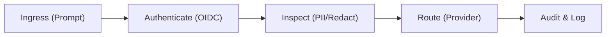

### 3. Distributed GenAI Gateway Topology
Strategically orchestrating AI traffic across global Anycast edges, regional model hubs (OpenAI/AWS), and internal developer sandboxes, providing a unified institutional view of global AI health and routing readiness.

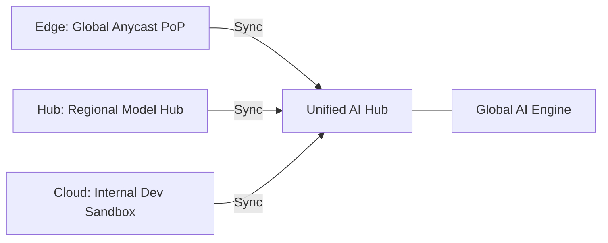

### 4. Multi-Provider Model Orchestration Flow
Executing complex logic for securing the bridge between user-provided prompts and a federated fleet of LLM providers (Azure, AWS, GCP, Anthropic), ensuring every organizational identity is verified and every AI access is according to institutional standards.

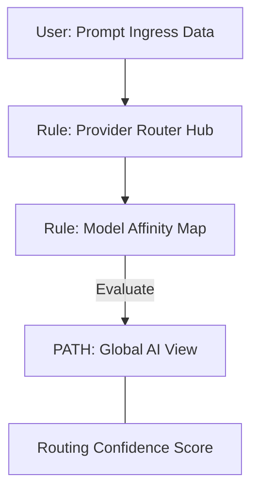

### 5. Multi-Tenant AI Isolation & Governance Flow
Automatically managing tenant isolation and cross-entity model quotas for global AI platforms, ensuring institutional data residency and security boundaries by default.

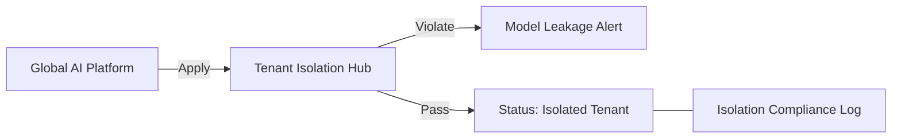

### 6. Encryption & Data Plane Protection Flow (TLS Standard)
Managing the lifecycle of a TLS session, automatically enforcing institutional encryption standards and secure header verification as required by security policy, ensuring zero-latency security confidence.

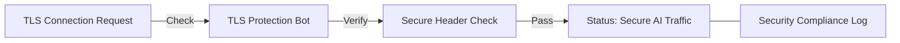

### 7. Institutional GenAI Maturity Scorecard
Grading organizational performance based on key indicators: Prompt Latency Score, Model Availability Grade, and Security Coverage Index (PII).

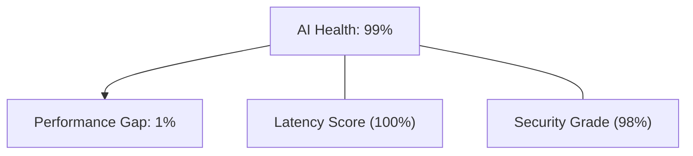

### 8. Identity & RBAC for GenAI Governance
Managing fine-grained access to AI hubs, provisioning workers, and audit logs between AI Architects, FinOps Leads, and Application Developers.

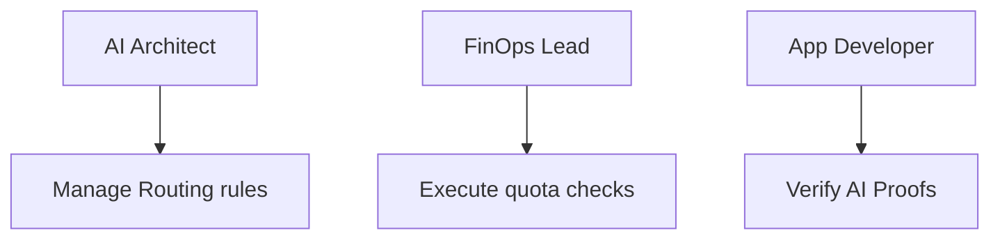

### 9. IaC Deployment: GenAI-Gateway-as-Code Framework
Using modular Terraform to deploy and manage the versioned distribution of the AI tracking hubs, provider connectors, and forensic metadata lakes.

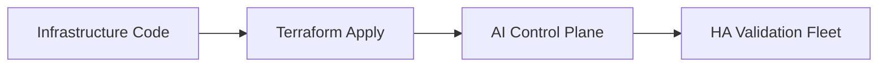

### 10. AIOps AI Performance & Drift Validation Flow
Using advanced analytics to identify sudden surges in model latency, token usage anomalies, suspicious configuration drifts, or unusual AI pattern changes that could result in institutional risk.

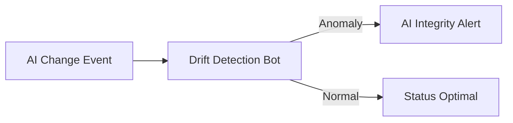

### 11. Metadata Lake for Forensic GenAI Audit
Storing long-term records of every prompt routed (metadata), every policy change recorded, and every provider failover event for institutional record-keeping, compliance auditing, and post-provisioning forensics.

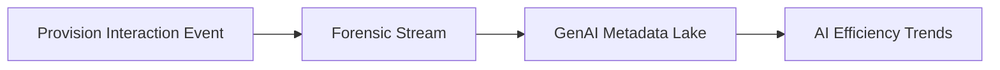

---

## 🏛️ Core Governance Pillars

1.  **Unified Foundation Coordination**: Maximizing resilience by centralizing all AI measurement through a single institutional plane.
2.  **Automated Model Provisioning**: Eliminating "manual router" scenarios through proactive orchestration and pattern verification.
3.  **Sequential Routing Intelligence**: Ensuring zero-interruption operations through dependency-aware edge-driven AI engineering.
4.  **Zero-Trust AI Protection**: Automatically enforcing identity-based access and rule evaluation across all AI tiers.
5.  **Autonomous Operations Logic**: Guaranteeing reliability through automated industry-specific AI monitoring runbooks.
6.  **Full AI Auditability**: Immutable recording of every routing change and AI provision for institutional forensics.

---

## 🛠️ Technical Stack & Implementation

### AI Engine & APIs
*   **Framework**: Python 3.11+ / FastAPI (Async).
*   **Routing Engine**: Custom Python-based logic for multi-cloud AI provisioning and DORA-style AI metrics.
*   **Integrations**: Native connectors for Azure OpenAI, AWS Bedrock, Google Vertex AI, and Anthropic APIs.
*   **Persistence**: PostgreSQL (AI Ledger) and Redis (Live AI State).
*   **Auth Orchestrator**: Federated OIDC/SAML for least-privilege AI management access.

### Governance Dashboard (UI)
*   **Framework**: React 18 / Vite.
*   **Theme**: Dark, Teal, Indigo (Modern high-fidelity AI aesthetic).
*   **Visualization**: D3.js for AI topologies and Recharts for safety velocity analytics.

### Infrastructure & DevOps
*   **Runtime**: AWS EKS or Azure Kubernetes Service (AKS) for management plane.
*   **AI Hub**: Managed event sourcing for immutable AI security timeline reconstruction.
*   **IaC**: Modular Terraform for deploying the GenAI landing zone and validation fleet.

---

## 🏗️ IaC Mapping (Module Structure)

| Module | Purpose | Real Services |
| :--- | :--- | :--- |
| **`infrastructure/ai_hub`** | Central management plane | EKS, PostgreSQL, Redis |
| **`infrastructure/providers`** | Distributed provider connectors | Azure, AWS, GCP APIs |
| **`infrastructure/routing`** | Global AI Ingestion Hubs | Webhooks, Lambda |
| **`infrastructure/auditing`** | Forensic AI sinks | S3, Athena, Quicksight |

---

## 🚀 Deployment Guide

### Local Principal Environment
```bash
# Clone the landing zone platform
git clone https://github.com/devopstrio/genai-gateway.git
cd genai-gateway

# Configure environment
cp .env.example .env

# Launch the GenAI stack
make init

# Trigger a mock prompt routing update and automated provider failover validation simulation
make simulate-ai
```

Access the Management Portal at `http://localhost:3000`.

---

## 📜 License
Distributed under the MIT License. See `LICENSE` for more information.

---
<div align="center">
  <p>© 2026 Devopstrio. All rights reserved.</p>
</div>
